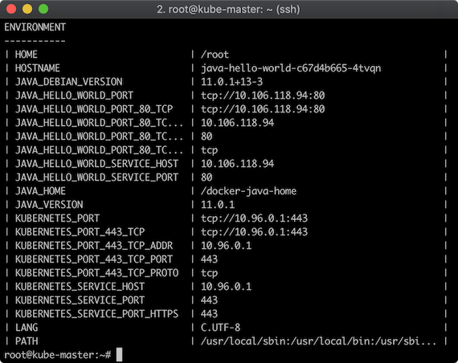

Java Hello World
================

Demo Java application for Kubernetes.

Overview
--------

The demo application runs an HTTP service on port 8080, listing all environment variables:



This is useful for exploring the environment of the current Kubernetes pod. For example, the `HOSTNAME` variable contains the name of the pod serving the request.

Build
-----

Option 1: Build the Docker image explicitly:

```sh
mvn package
docker build -t fstab/java-hello-world .
```

Option 2: Build using the Docker maven plugin:

```sh
mvn package docker:build
```

A pre-built Docker image is available on [fstab/java-hello-world](https://hub.docker.com/r/fstab/java-hello-world/).

Run
---

Test locally:

```sh
docker run -p8080:8080 --rm fstab/java-hello-world
```

Deploy on Kubernetes

```yaml
kubectl create -f java-hello-world.yaml
```

The yaml file references the Docker image [fstab/java-hello-world](https://hub.docker.com/r/fstab/java-hello-world/). If you create your own image, update the image location in the yaml file.

Test
----

Test locally:

View [http://localhost:8080](http://localhost:8080).

Test on Kubernetes:

1.  Get the service's cluster IP:
    ```bash
    export HELLO_WORLD_SERVICE_IP=$(kubectl get service java-hello-world -o=jsonpath='{.spec.clusterIP}')
    ```
2.  Access the pods through the service's cluster IP:
    ```bash
    curl $HELLO_WORLD_SERVICE_IP
    ```
